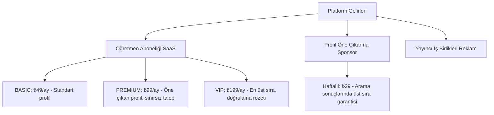

# Pazarlama & Çıkış Stratejisi (Launch & Exit Strategy)

Bu belge, **ders.online** (Online Özel Ders Pazaryeri) platformunun pazara giriş, büyüme, gelir yaratma ve nihayetinde başarılı bir şirket satışı (exit) ile sonlandırma stratejilerini detaylandırmaktadır. 

---

## 1. Pazar Analizi ve Değer Önerisi (Value Proposition)

### Mevcut Durum ve Rakiplerin Zayıf Yönleri
Türkiye'deki özel ders pazarı oldukça büyüktür fakat mevcut oyuncuların (örneğin *Superprof TR*, *Armut*, *Sahibinden*) ciddi zayıflıkları bulunmaktadır:
- **Superprof TR**: Arayüzü eski ve karmaşıktır. Mobil uygulamaları yetersiz webview'lardan ibarettir. Müşteri destek süreçleri yavaştır ve öğretmenlerden yıllık yüksek üyelik ücretleri talep eder.
- **Armut**: Teklif usulü çalışır. Anlık iletişim kurmak zordur ve her teklif için öğretmenlerden yüksek komisyon veya kredi ücreti keser.
- **Yüz Yüze Odaklılık**: COVID-19 ve artan ulaşım maliyetleri sonrası veliler/öğrenciler online derslere alışmıştır. Rakipler hibrit veya sadece yüz yüze odaklı kalırken, sadece online derse odaklanmış optimize bir platform bulunmamaktadır.

### Bizim Değer Önerimiz
> **"Türkiye'nin Sadece Online Ders Odaklı En Modern, Hızlı ve Sıfır Komisyonlu Özel Ders Pazaryeri"**

- **Modern ve Akıcı Tasarım**: Tailwind CSS v4 ve shadcn/ui ile geliştirilmiş, hem koyu tema (dark mode) destekleyen hem de göz yormayan, premium bir arayüz.
- **Sıfır Komisyon**: Öğrenciler ve öğretmenler ödemeleri doğrudan kendi aralarında (IBAN, havale veya elden) halleder. Platform ders ücretlerinden komisyon kesmez.
- **Real-Time İletişim**: WebSocket tabanlı anlık mesajlaşma ile e-posta bekleme derdi olmadan doğrudan chat üzerinden anlaşma.
- **Güvenilirlik ve Doğrulama**: Öğretmenler diploma ve kimlik belgelerini yükler, admin onayından geçerek doğrulanmış rozeti alır.

---

## 2. Pazarlama Kanalları ve Büyüme (Growth Hacking)

Platformun çift taraflı (double-sided) bir pazaryeri olması nedeniyle, arz (öğretmen) ve talep (öğrenci) dengeli bir şekilde büyütülmelidir.

### A. Öğretmen Kazanımı (Arz Tarafı - 1. Öncelik)
Öğrenciler gelmeden önce platformda kaliteli öğretmen profilleri olmalıdır.
1. **Outbound Direct Outreach (Doğrudan Erişim)**: 
   - Superprof, Instagram, LinkedIn ve Sahibinden üzerindeki aktif özel ders veren öğretmenlere ulaşılarak platform tanıtılır.
   - *"İlk 500 öğretmene 3 Ay VIP Üyelik Hediye"* kampanyası düzenlenerek profillerini doldurmaları sağlanır.
2. **Üniversite Toplulukları**:
   - ODTÜ, Boğaziçi, İTÜ, Koç, Bilkent gibi prestijli üniversitelerin öğrenci kulüpleri ve ilan grupları üzerinden ek gelir arayan başarılı üniversite öğrencileri platforma çekilir.

### B. Öğrenci Kazanımı (Talep Tarafı)
1. **Programatik SEO (Long-Tail Keywords)**:
   - *"LGS Matematik Online Özel Ders"*, *"YKS Fizik Soruları İçin Öğretmen"*, *"Kadıköy İngilizce Özel Ders"* gibi hedeflenmiş anahtar kelimeler için otomatik SEO sayfaları oluşturulur.
   - Blog içeriği üreterek LGS/YKS sınav taktikleri, tercih dönemleri gibi kritik zamanlarda organik trafik çekilir.
2. **TikTok & Instagram Reels Viralleri**:
   - Sınav hazırlık sürecindeki öğrencilerin yaşadığı stresli/komik durumlar, ders çalışma rutinleri ve öğretmenlerin paylaştığı pratik soru çözüm ipuçları kısa videolar halinde paylaşılır. 
   - Popüler eğitim influencer'ları ile mikro-ortaklıklar kurulur.
3. **Veli Grupları ve WhatsApp Toplulukları**:
   - Facebook veli grupları ve okul WhatsApp topluluklarında platformun "Sıfır Komisyon" ve "Doğrulanmış Öğretmen" vurgusu ile organik tavsiye (Word of Mouth) yayılımı tetiklenir.

---

## 3. Gelir Modeli (Monetization)

Platform, ders ücretlerine aracı olmadığı ve komisyon almadığı için gelirini **SaaS (Yazılım Servisi) ve Reklam** modeli üzerinden oluşturur.

### Detaylı Gelir Akışları
1. **Tutor Abonelik Paketleri**:
   - **BASIC (₺49 / Ay)**: Standart listeleme, aylık 10 ders talebi kabul etme hakkı.
   - **PREMIUM (₺99 / Ay)**: Arama sonuçlarında orta sıralarda listelenme, sınırsız ders talebi kabul etme, profil analitiği görme.
   - **VIP (₺199 / Ay)**: Aramalarda en üstte çıkma, profilinde "VIP Doğrulanmış" rozeti, ilk ders talebi bildirimlerini anında alma.
2. **Sponsorlu Profil (Öne Çıkarma)**:
   - Öğretmenlerin haftalık ₺29 karşılığında kendi kategorilerinde en üstte reklamlı olarak listelenmesi.
3. **Yayıncı ve Kırtasiye İş Birlikleri**:
   - Sınav hazırlık kitapları satan yayınevleri ve online eğitim platformları (örn. doping hafıza benzeri sistemler) ile affiliate (ortaklık) reklamları.

---

## 4. Çıkış Stratejisi (Exit Strategy)

Bu proje, başından itibaren büyük bir oyuncu tarafından satın alınmak (acquisition) üzere tasarlanmıştır.

### Potansiyel Alıcılar (Acquirers)
1. **Global Özel Ders Devleri**: Türkiye pazarına hızlıca girmek ve yerel operasyon kurmak isteyen global platformlar (*GoStudent*, *Preply*, *Superprof*).
2. **Büyük Eğitim Kurumları & Yayınevleri**: Fiziksel dershanelerini online dünya ile birleştirmek ve hazır bir marketplace altyapısına sahip olmak isteyen büyük Türk eğitim grupları (örn. *Bahçeşehir*, *Doğa Koleji* veya *Final Grubu*).
3. **EdTech Yatırım Fonları**: Hızlı büyüyen abonelik gelirli dikey pazar yerlerini konsolide eden yatırım şirketleri.

### Satış Değerlemesini (Valuation) Artıran Teknik ve İşsel Kozlarımız
Satış görüşmelerinde projenin değerini artıran en kritik unsurlar teknik mükemmelliktir:

- **Sıfır Teknik Borç ve Modern Stack**: Spring Boot backend ve React + Tailwind v4 + Vite frontend yapısının temizliği, kod tabanının kolayca devredilebilmesini sağlar.
- **Yüksek E2E Test Kapsamı (Playwright)**: Tüm kritik kullanıcı senaryoları (auth, search, booking, payment, chat) Playwright ile test edilmiştir. Bu, sistemin stabil olduğunu kanıtlar ve alıcının entegrasyon riskini sıfıra indirir.
- **WebSocket & Real-time Hazır Altyapı**: Canlı sohbet altyapısının ölçeklenebilir ve hazır olması, büyük bir geliştirme maliyetinden tasarruf ettirir.
- **KVKK ve Güvenlik Standartları**: GDPR/KVKK uyumlu veri saklama şeması, şifreli kimlik doğrulamaları ve audit logları sayesinde yasal denetimlerden (due diligence) sıfır hata ile geçmesi.

---

## 5. Çıkış Öncesi Hedef Metrikler (KPIs)
Exit aşamasına geçebilmek için platformun ulaşması gereken minimum finansal ve operasyonel hedefler:
- **Aktif Doğrulanmış Öğretmen**: 1,000+
- **Aktif Kayıtlı Öğrenci**: 5,000+
- **Aylık Eşleşen Başarılı Ders**: 2,500+
- **Aylık Tekrarlayan Gelir (MRR)**: ₺150,000 - ₺250,000 (SaaS abonelikleri ve öne çıkarmalardan).
- **Yıllık Gelir Çalışma Hızı (Annual Run Rate)**: ₺2M+
- **Teknik Kapsam**: %90+ Playwright E2E Test Coverage.
